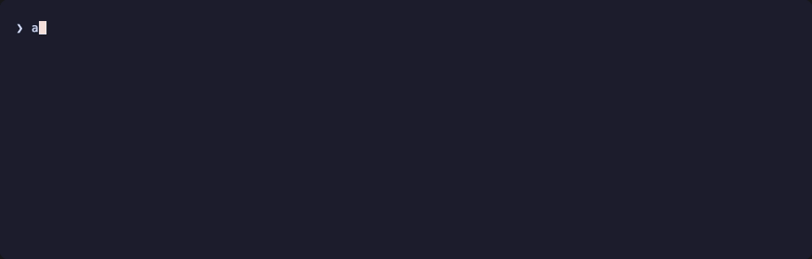

# aula-mcp

[](https://github.com/Casperjuel/aula-mcp/actions)
[](./LICENSE)
[](https://bun.sh)
[](https://pnpm.io)
[](https://modelcontextprotocol.io)
[](#development)

> Ask Claude (or any MCP client) about your kid's school in plain Danish — and have it actually answer, with live data from [Aula](https://www.aula.dk).


`aula-mcp` is a self-hosted **Model Context Protocol** server for Aula, the platform every Danish primary school runs on. It speaks the full Aula API (messages, calendar, presence, posts, notifications, ugeplaner) plus the third-party widgets schools layer on top (EasyIQ, EasyIQ SkolePortal, Meebook, Min Uddannelse, Systematic). Auth is a from-scratch port of the MitID protocol — no headless browser, no Playwright, no SaaS layer. All Aula data stays on your machine.

TypeScript + Bun + Hono. Spiritual successor to [`scaarup/aula`](https://github.com/scaarup/aula) (the Home Assistant Python integration), reshaped for AI agents.

---

## Table of contents

- [Quickstart](#quickstart)
- [Connect to Claude Code (or claude.ai)](#connect-to-claude-code-or-claudeai)
- [What's inside the manifest](#whats-inside-the-manifest)
- [CLI reference](#cli-reference)
- [Configuration](#configuration)
- [Architecture](#architecture)
- [Bake-ins from upstream Aula issues](#bake-ins-from-upstream-aula-issues)
- [Troubleshooting](#troubleshooting)
- [Development](#development)
- [Contributing](#contributing)
- [Privacy & legal](#privacy--legal)

---

## Quickstart

Requires **[Bun](https://bun.sh) ≥ 1.3** and **[pnpm](https://pnpm.io) ≥ 10**. macOS or Linux.

```sh
git clone git@github.com:Casperjuel/aula-mcp.git
cd aula-mcp
pnpm install

# 1. Sanity check
pnpm typecheck && pnpm lint && pnpm test

# 2. First-time MitID login (QR code with the MitID app)
pnpm login

# 3. Health-check every Aula endpoint
pnpm doctor

# 4. Run the MCP server (http://127.0.0.1:7878/mcp)
pnpm mcp
```

Most CLI commands have a top-level shortcut: `pnpm login`, `pnpm doctor`, `pnpm whoami`, `pnpm status`, `pnpm logout`. For anything else, `pnpm aula <command>` forwards to the CLI (e.g. `pnpm aula transcript list`, `pnpm aula log --last 5`).

That's it — you have a running, single-user MCP server fronting Aula on your laptop.

The `doctor` command walks every read endpoint and reports per-call status with timing. It's the fastest "is this thing actually working?" check:


`whoami` confirms which identity the tokens are for and which children come back from `getProfilesByLogin`:



---

## Connect to Claude Code (or claude.ai)

### Claude Code (recommended for local use)

```sh
# 1. Server running in one terminal
pnpm mcp

# 2. Register the server with Claude Code, one-time
claude mcp add --transport http aula http://127.0.0.1:7878/mcp

# 3. In any Claude Code session, confirm it's connected
/mcp
```

Then prompt naturally — kids' names get fuzzy-matched against the discover manifest, no IDs needed:

> *hvad står der på ugeplanen næste uge for theo*

Claude calls `aula.discover` once, picks the right ugeplan vendor for your school from `detectedWidgets`, and answers in your language with Danish-formatted dates.

### Claude Desktop

Drop the snippet from [`examples/claude-config/claude-desktop.json`](./examples/claude-config/claude-desktop.json) into `~/Library/Application Support/Claude/claude_desktop_config.json`.

### claude.ai (web)

The web UI requires a public HTTPS URL — `127.0.0.1` won't work, the connection happens server-side from Anthropic's cloud. For a quick test:

```sh
cloudflared tunnel --url http://127.0.0.1:7878
# → https://<random>.trycloudflare.com — paste with `/mcp` appended
```

> ⚠️ **The tunnel URL is publicly reachable while running** — anyone who guesses it controls your Aula tokens. Fine to demo, don't leave it up. For permanent setup, deploy the server to a real host behind your own auth (Caddy / authenticated reverse proxy).

---

## What's inside the manifest

Agents call `aula.discover` once and reuse the result for the rest of the session. The manifest tells the agent who the user is, which children they can act on behalf of, which third-party widgets the schools have provisioned, and which subordinate MCP tools to call:


Shape:

```ts
{
  user: { name, username, identityName? },
  children: [{ id, name, userId?, institution: { id, name?, code? } }],
  apiVersion: 23,
  tokens: { expires_at, seconds_remaining },
  detectedWidgets: ['0001', '0029', '0030'],   // from Aula's pageConfiguration
  capabilities: {
    profiles:      { summary, tools: ['aula.profiles.list'] },
    presence:      { summary, tools: ['aula.presence.today'] },
    calendar:      { summary, tools: ['aula.calendar.events'] },
    messages:      { summary, tools: ['aula.messages.list_threads', 'aula.messages.get_thread'] },
    notifications: { summary, tools: ['aula.notifications.list'] },
    posts:         { summary, tools: ['aula.posts.list'] },
    ugeplan:       { summary, tools: ['aula.ugeplan.easyiq'] },          // detected provider only
    opgaver:       { summary, tools: ['aula.opgaver.minuddannelse'] },
    ugebrev:       { summary, tools: ['aula.ugebrev.minuddannelse'] },
    huskelisten:   { summary, tools: ['aula.huskelisten.systematic'] }
  },
  usage: {
    cache, nameResolution, pickOne, timeWindows, language
  },
  rawRequestEnabled: false
}
```

`capabilities[area].tools[0]` is always the right tool to call — when a school's widgets are detected we list only the matching provider, so the agent doesn't fan out across vendors. The inline `usage` block tells the agent how to behave (cache the manifest, fuzzy-match kid names, default to Europe/Copenhagen, reply in the user's language).

---

## CLI reference

```
aula login [--username <user>] [--method APP|CODE_TOKEN] [--debug] [--transcript <file>]
aula status [--json]
aula whoami [--json]
aula doctor [--json] [--verbose]
aula log [--last N] [--json]
aula transcript {list|view <file>|prune} [--json] [--keep N] [--dry-run]
aula logout
aula --help
```

| Command | What it does |
| ------- | ------------ |
| `aula login` | Walks the full MitID flow (APP method by default — scans QR with the MitID app). Saves tokens. `--debug` captures a sanitised wire transcript so failures are diagnosable. |
| `aula status` | Prints token presence, expiry, and active identity. Doesn't hit the network. Exit code 1 when no tokens. |
| `aula whoami` | Loads tokens (refreshes if needed), calls `getProfilesByLogin` + `getProfileContext`. Smoke test that the auth + client pipeline works end-to-end. |
| `aula doctor` | Walks every read endpoint and reports per-call status with timing. The fastest "is this thing actually working?" check. `--verbose` dumps the wire transcript inline on failure. |
| `aula log` | Recent login attempts (success/failure, timestamps, error class). |
| `aula transcript` | Inspect captured `--debug` transcripts; `prune` keeps the last N (default 10). |
| `aula logout` | Clears stored tokens. The encryption key file is kept so the next login reuses it. |

Full help with examples: `pnpm aula --help`


---

## Configuration

### Token storage

| Platform | Default | Override |
| -------- | ------- | -------- |
| macOS | Keychain (`security` CLI; service `aula-mcp`, account `tokens`) | `AULA_MCP_NO_KEYCHAIN=1` falls back to the file backend |
| Linux / Windows | AES-256-GCM-encrypted file at `~/.config/aula-mcp/tokens.json` | `AULA_MCP_KEY=<hex|passphrase>` for the encryption key (else generated at `~/.config/aula-mcp/.key`, `chmod 600`) |

### Server environment variables

| Variable | Default | Effect |
| -------- | ------- | ------ |
| `AULA_MCP_PORT` | `7878` | Bind port. |
| `AULA_MCP_HOST` | `127.0.0.1` | Bind interface. Refuses non-loopback unless `AULA_MCP_ALLOW_REMOTE=1`. |
| `AULA_MCP_DIR` | `~/.config/aula-mcp` | Config dir (file backend + transcripts + login log). |
| `AULA_MCP_RAW=1` | off | Enables the `aula.raw_request` escape-hatch tool. |
| `AULA_MCP_LOG=1` | off | Verbose console logs from the auth/client layers. |
| `AULA_MCP_ALLOW_REMOTE=1` | off | Allow binding to non-loopback addresses (e.g. behind a reverse proxy). |

### Wire transcripts

`--debug` mode tees a JSONL transcript of every HTTP request/response to `~/.config/aula-mcp/transcripts/login-<timestamp>.jsonl`. Cookies, OAuth/SAML payloads, MitID auth codes, passwords, M1, flowValueProof, the `access_token` query param, and other secret fields are all redacted (`<redacted N chars>`). The transcript is safe to paste into a GitHub issue.

`aula transcript view <file>` pretty-prints one of these.

---

## Architecture

```
packages/
  aula-auth/    — MitID + 3072-bit SRP-6a + OAuth/SAML chain + token store + wire-trace
  aula-client/  — Aula REST API + version probing + integration plugins
  mcp-server/   — Hono + @modelcontextprotocol/sdk + aula.discover + 11 capability tools
apps/
  cli/          — aula login/status/whoami/doctor/log/transcript/logout
```

Cross-package imports use the workspace name (`@aula-mcp/aula-auth`); Bun resolves `.ts` directly so there's no build step in dev. `tsc -p tsconfig.json --noEmit` runs in CI for type-checking only.

| Layer | Status | Notes |
| ----- | ------ | ----- |
| `@aula-mcp/aula-auth` | ✅ unit-tested + live-verified | MitID APP + CODE_TOKEN + PASSWORD; macOS Keychain or AES-GCM file. |
| `@aula-mcp/aula-client` | ✅ unit-tested | Native Aula API + EasyIQ / EasyIQ SkolePortal / Meebook / Min Uddannelse / Systematic plugins. |
| `@aula-mcp/mcp-server` | ✅ unit-tested + live-verified with Claude Code | Streamable HTTP transport, stateful session. Single-user, loopback by default. |
| `apps/cli` | ✅ unit-tested | QR rendering, debug transcripts, JSONL login log. |

`@aula-mcp/aula-auth` and `@aula-mcp/aula-client` use only Web standards + `node:crypto` + `node:child_process` — they run on Node ≥ 20 as well as Bun. The MCP server uses `Bun.serve` and is Bun-only. CLI uses Bun's TS support and ships via `bun build --compile`. To use the libraries from a Node script, see [`examples/script/`](./examples/script/).

Detailed design rationale: [docs/architecture.md](./docs/architecture.md).

---

## Bake-ins from upstream Aula issues

The Python integration has years of accumulated lessons in its issue tracker. We pre-empted the top ones:

| Upstream issue / PR | Mitigation |
| ------------------- | ---------- |
| [#311](https://github.com/scaarup/aula/issues/311) — sensor goes dead when widget JWT expires | `WidgetTokenManager.withRetry` detects `{"message":"JWT-Token expired..."}` (and 401/403) and refreshes once before retrying. |
| [#246, #248](https://github.com/scaarup/aula/issues/246) — Aula API version drifts (v22 → v23 mid-life) | `AulaClient` probes versions lazily, retries once on 410, fires `onApiVersionChanged` on bumps. |
| [#310](https://github.com/scaarup/aula/issues/310) — RelayState missing from Level-3 SAML response | `extractSamlForm` returns `hadRelayState: false` and an empty string instead of throwing. |
| [#306, #287](https://github.com/scaarup/aula/issues/306) — `post-broker-login` returns 200 with confirmation form instead of 302 | `detectConfirmationForm` finds `button#confirmation-button`, submits its parent form, then continues. |
| [#290, #351](https://github.com/scaarup/aula/issues/351) — `password`/`token` required for auth methods that don't need them | `AulaLoginOptions` only demands fields per chosen `method`. APP method needs no password. |
| [PR #352](https://github.com/scaarup/aula/pull/352) — EasyIQ SkolePortal (widget 0128) | Implemented as `EasyIqSkoleportalClient` + `aula.ugeplan.easyiq_skoleportal` MCP tool. Per-child auth + Danish-entity decode. |
| Sensitive messages (`status.code` 403) | Surfaced as the typed `AulaStepUpRequiredError`; MCP tool returns a structured `step_up_required` JSON instead of empty data. |

---

## Troubleshooting

| Symptom | Likely cause / fix |
| ------- | ------------------ |
| `aula login` hangs after username prompt | The MitID app hasn't been opened yet, or the QR codes haven't rendered (terminal too narrow). Make sure your terminal is ≥ 80 cols. |
| `Login failed: MitID initialize failed (status …)` | nemlog-in.mitid.dk is unreachable or returned an error. Re-run with `--debug` and inspect the transcript. |
| `Login failed: APP poll error: …` | The MitID app rejected or cancelled. Check that the MitID app is logged into your account. |
| `Login failed: appProve failed (status …)` | Rare — MitID rejected the SRP proof. Re-run with `--debug` and inspect `~/.config/aula-mcp/transcripts/login-<timestamp>.jsonl`. |
| `aula whoami` → `step_up_required` for messages | A specific thread is sensitive (Aula returns 403). Re-run `aula login` to re-establish a step-up session, then retry. |
| `aula doctor` says `Aula API v22 → 410` | The API version has bumped. Run `aula doctor` again — `AulaClient` will probe forward and remember. |
| `aula status` shows `expired N min ago` | Tokens expired since last use. Any read call (or `aula doctor`) will refresh them automatically. |
| MCP server: `Refusing to bind to non-loopback address` | You set `AULA_MCP_HOST` to `0.0.0.0` or similar. The server is single-user; anyone hitting `/mcp` becomes you. Set `AULA_MCP_ALLOW_REMOTE=1` if you understand the implications. |

When something fails, the JSONL transcript at `~/.config/aula-mcp/transcripts/login-<timestamp>.jsonl` (after `--debug`) is the first thing to look at. `aula transcript view <file>` pretty-prints it.

---

## Development

```sh
pnpm install          # install everything
pnpm typecheck        # tsc -p tsconfig.json --noEmit
pnpm lint             # biome check .
pnpm lint:fix         # biome check --write .
pnpm test             # bun:test suites (209 cases)
pnpm test:watch       # re-run on change
```

All other top-level scripts: `pnpm aula <cmd>`, `pnpm mcp`, plus the per-command shortcuts (`pnpm login`, `pnpm doctor`, `pnpm whoami`, `pnpm status`, `pnpm logout`).

---

## Contributing

See [CONTRIBUTING.md](./CONTRIBUTING.md) for repo layout, conventions, and a guide for adding integration plugins. Contributors agree to follow the [Code of Conduct](./CODE_OF_CONDUCT.md). Security issues: please email **cj@signifly.com** rather than opening a public issue — see [SECURITY.md](./SECURITY.md).

---

## Privacy & legal

All tokens stay on your machine. The MCP server runs on `localhost` by default — no external dependencies. The wire-trace tooling is opt-in (`--debug` flag) and redacts every known-secret field.

The reference Python repo is for personal/family use of one's own children's school data. This project is the same — log in as yourself with your own MitID; do not use to access anyone else's account.

> **Disclaimer.** This project is not affiliated with, endorsed by, or sponsored by KMD A/S, Netcompany A/S, or the Aula consortium. *Aula* is a trademark of its respective owner; the name is used here solely to identify what this software talks to.

---

## License

[MIT](./LICENSE).
